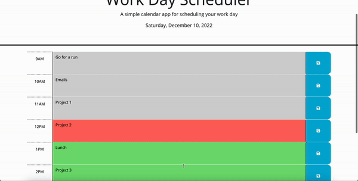

# Workday Scheduler

## Description

Workday Scheduler is a usefool tool for indivdiuals who are planning their day. At the top of the screen, it will remind you of the date. Then, it shows slots for typical workday hours (9 AM to 5 PM). Time slots that have passed will be shaded grey, time slots in the future will be shaded green, and the current time slot will be red. 

Users can enter their plan for each hour / time slot and hit the blue save button on the right for each slot. That plan will then be stored in local storage so it will stay there despite closing/reloading your browser page. 

## Screenshot

Below is an example of the Workday Scheduler at 12:30 PM. It shows a pre-loaded schedule from local storage, then an edit being made and saved, the page being reloaded, and the edit persisting. 

## Link to Workday Scheduler

The Workday Scheduler can be found by clicking [here](https://mshaari.github.io/work-day-scheduler/).